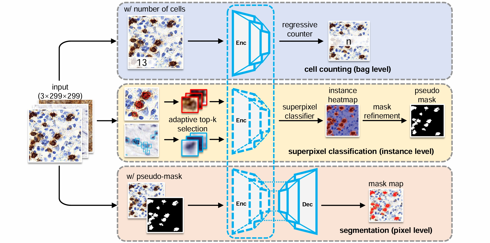
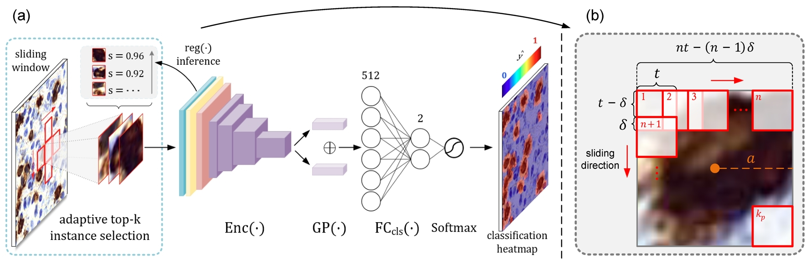

## Counting is All You Need: Weakly-Supervised Immunohistochemical Cell Segmentation by Numbers

We propose a weakly-supervised learning method for IHC staining pathological cell 
imgae analysis, which can perform cell segmentation using only positive cell 
counting labels. 

Special thanks to Dr. Cheng [@ShenghuaCheng](https://github.com/ShenghuaCheng) for contributing to this work 
and [WNLO](http://wnlo.hust.edu.cn/) for platform provision. 

### MIL for immune cell pathological images

Taking immunohistochemistry-stained digital cell images as input, the model is merely
supervised by positive cell counting labels and transforms whole-image (bag) level 
counting results into superpixel (instance) level classification results via the 
specifically designed adaptive top-k instance selection strategy.

### Network frame

- Stage 1: Image-wise regressive positive cell counter
- Stage 2: Superpixel-wise tile instance classifier
- Stage 3: Pixel-wise segmentation encoder-decoder network

### Adaptive top-k selection

We select top k valuable instances from a image through instance classifier with
reused encoder to train the instance classifier.
For negative bags, top kn tiles which are easy to be regard as positive tiles are
selected and matched with negative labels.
For positive bags, top kp tiles which may be positive tiles are selected and 
matched with positive labels.

### Mask refinement

Instance classifier provides semantic information of positive cells. HSV channel 
separation and thresholding provide us fine-grained boundary of positive cells.
Therefore, we employ a mask fusion approach and adopt Pixel Adaptive Refinement
module to further refine the combined masks.

[//]: # (### Grand Challenge results)

[//]: # ()
[//]: # (Kappa = 0.9319, 4th in **Lymphocyte Assessment Hackathon** &#40;LYSTO&#41; Challenge. [Leaderboard]&#40;https://lysto.grand-challenge.org/evaluation/challenge/leaderboard/&#41;)

[//]: # ()
[//]: # (We also tested our localization method in [LYON19]&#40;https://lyon19.grand-challenge.org/&#41;. )

### Dataset

Visit [LYSTO](https://lysto.grand-challenge.org/) to get data.

### Quick Start

- Add image data in `./data`
- Train cell counter by `python train_image.py`
- Test your counter by `python test_count.py`
- Train tile classifier by `python train_tile.py`
- Test the classifier and get heatmaps by `python test_tile.py`
- Train segmentation network by `python train_seg.py`
- Test segmentation network and get masks by `python test_seg.py`

and use arguments you like. You can find arguments list in the source code file. 

[//]: # (### Citing)

[//]: # ()
[//]: # (... under construction ... stay tuned. )

> 2021-2022 By Newiz
